# User Flow Documentation
## Hospital Appointment Management System (HAMS)

| | |
|---|---|
| **Document Type** | User Flow Documentation |
| **Project Name** | Hospital Appointment Management System |
| **Version** | 1.0 |
| **Audience** | Product, Design, Frontend & QA teams |
| **Related Documents** | REQUIREMENT_ANALYSIS.md, PRD.md, DESIGN_GUIDELINES.md, API_SPECIFICATION.md |

---

## Table of Contents

1. [Overview](#overview)
2. [Flow Notation Legend](#flow-notation-legend)
3. [Guest Flows](#guest-flows)
4. [Patient Flows](#patient-flows)
5. [Doctor Flows](#doctor-flows)
6. [Administrator Flows](#administrator-flows)
7. [Cross-Cutting Flows](#cross-cutting-flows)
8. [Edge Case & Exception Flows](#edge-case--exception-flows)
9. [Appointment Status State Machine](#appointment-status-state-machine)
10. [Screen Inventory by Flow](#screen-inventory-by-flow)
11. [Flow Completion Checklist](#flow-completion-checklist)

---

## Overview

This document maps every significant user flow through HAMS — the exact sequence of screens, decisions, system responses, and exit points a user encounters while completing a goal. It complements the **PRD's** high-level User Journeys with granular, implementation-ready detail: every branch, error state, and edge case a frontend engineer or QA tester needs to build and verify the experience correctly.

Flows are organized by role (Guest, Patient, Doctor, Administrator), followed by cross-cutting flows that apply across roles (authentication, notifications, session handling) and a dedicated section for edge cases that require special handling (booking conflicts, doctor leave, cancellation policy violations).

Each flow includes a **Mermaid flowchart** for visual reference alongside a numbered step-by-step breakdown covering the happy path, decision branches, and failure states.

---

## Flow Notation Legend

| Symbol / Term | Meaning |
|---|---|
| **Screen** | A distinct page or view the user lands on |
| **Action** | A user-initiated interaction (click, submit, select) |
| **Decision** | A branch point where the system or user chooses between paths |
| **System Response** | An automated outcome (validation, notification, redirect) |
| **Happy Path** | The ideal, no-error sequence toward the user's goal |
| **Exit Point** | Where the user can leave the flow (successfully or by abandoning) |
| ✅ | Successful outcome |
| ⚠️ | Recoverable error / validation issue |
| ⛔ | Blocking condition (policy or authorization) |

---

## Guest Flows

### G1 — Browse & Discover (Public Exploration)

**Goal:** A Guest explores the platform to evaluate whether to register.

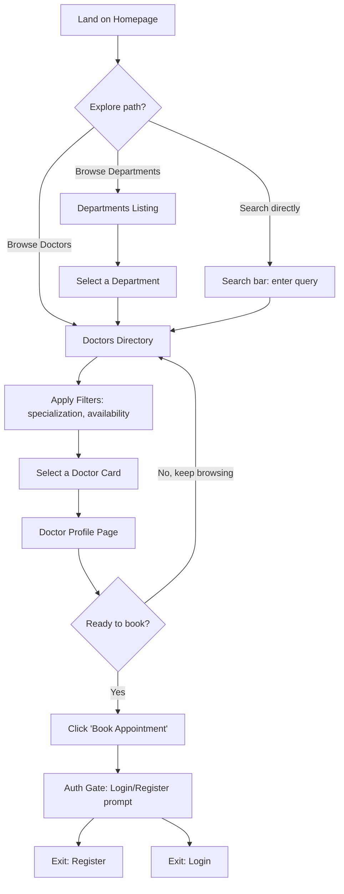

**Steps:**
1. Guest lands on the **Homepage** — sees hero CTA, featured departments, top-rated doctors, trust statistics.
2. Guest navigates to **Departments Listing** or **Doctors Directory** via nav, homepage links, or the search bar.
3. Guest applies filters (department, specialization) and/or free-text search on the Doctors Directory.
4. Guest selects a **Doctor Profile** to review qualifications, fee, bio, availability preview, and reviews.
5. **Decision:** Guest continues browsing, or clicks **"Book Appointment."**
6. Clicking "Book Appointment" while unauthenticated triggers the **Auth Gate** (see Cross-Cutting Flow C1) rather than a dead-end error — the intended doctor/slot context is preserved so the user resumes exactly where they left off after authenticating.
7. **Exit points:** Guest closes the tab (no action taken), or proceeds to Register/Login.

**Edge Cases:**
- Search returns zero results → Empty State with "Clear filters" action (per DESIGN_GUIDELINES.md).
- Doctor profile for an `inactive`/`suspended` doctor is never publicly reachable — returns a standard 404-style "Doctor not found" page, not an error exposing internal status.

---

### G2 — Registration

**Goal:** A Guest converts into a registered Patient.

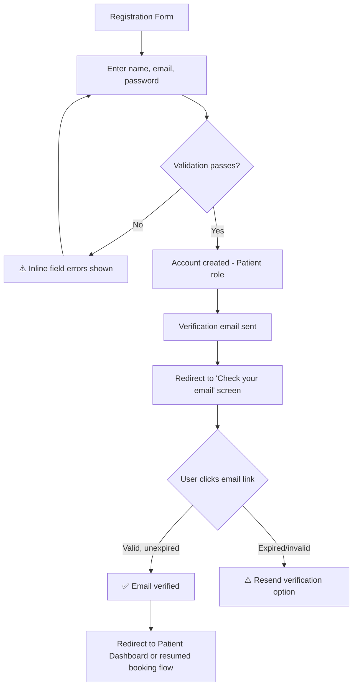

**Steps:**
1. Guest fills the **Registration Form** (name, email, password, confirm password).
2. Client-side + server-side validation runs on submit.
3. On success: account is created with the `patient` role; a verification email is dispatched.
4. Guest is redirected to a **"Check your email"** confirmation screen (not silently logged in unverified).
5. Guest clicks the verification link → redirected back to the app, session established, email marked verified.
6. If the Guest had been mid-booking before registering, they are **returned to that exact booking context** (doctor + slot preserved via a redirect intent parameter) rather than dropped at a generic dashboard.
7. If no booking context existed, the user lands on the **Patient Dashboard**.

**Edge Cases:**
- Email already registered → inline error on the email field: "An account with this email already exists. [Log in instead]."
- Verification link expired → landing screen offers a one-click "Resend verification email" action, rate-limited to prevent abuse.
- User attempts to log in before verifying → allowed to authenticate, but booking and other Patient-only actions remain blocked with a persistent banner prompting verification.

---

## Patient Flows

### P1 — Appointment Booking (Primary Flow)

**Goal:** A logged-in, verified Patient books a new appointment.

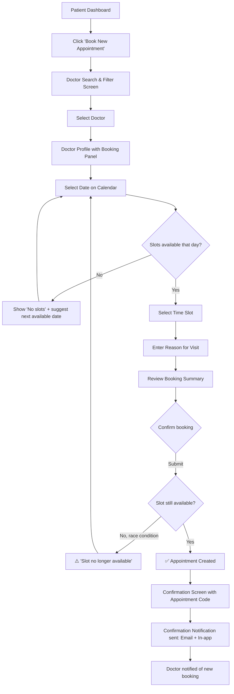

**Steps:**
1. Patient clicks **"Book New Appointment"** from the dashboard, or arrives here directly from a Doctor Profile.
2. Patient searches/filters for a doctor (department, specialization) if not already selected.
3. Patient opens the **Doctor Profile**, which includes an embedded booking panel (calendar + time picker).
4. Patient selects a date → system fetches real-time available slots for that doctor/date via the availability endpoint.
5. **Decision:** If no slots exist for the selected date, the UI clearly states this and suggests the next available date rather than showing an empty grid with no explanation.
6. Patient selects a time slot → enters a **reason for visit** (required field, validated for length).
7. Patient reviews the **Booking Summary** (doctor, date/time, fee, reason) before final confirmation — no accidental one-click booking.
8. On submission, the system re-validates slot availability server-side (protecting against race conditions from concurrent bookings).
9. **Success:** Appointment created → dedicated **Confirmation Screen** (not just a toast) displaying the appointment code, calendar-add option, and next steps.
10. System dispatches a confirmation notification to the Patient (email + in-app) and a new-booking notification to the Doctor.

**Edge Cases:**
- Slot taken between selection and submission (concurrency) → Patient is returned to slot selection with an inline explanation and refreshed availability, never a generic error.
- Patient attempts to book two overlapping appointments with the same doctor → blocked with a clear message before submission.
- Patient's email is unverified → booking blocked at step 1 with a redirect to the verification prompt (see G2 edge cases).
- Doctor's `consultation_fee` changes after the summary was shown but before submission → the fee is re-snapshotted server-side at creation time; if materially different, the Patient sees an updated summary requiring re-confirmation.

---

### P2 — View & Manage Appointments

**Goal:** A Patient reviews upcoming/past appointments and takes action (reschedule/cancel).

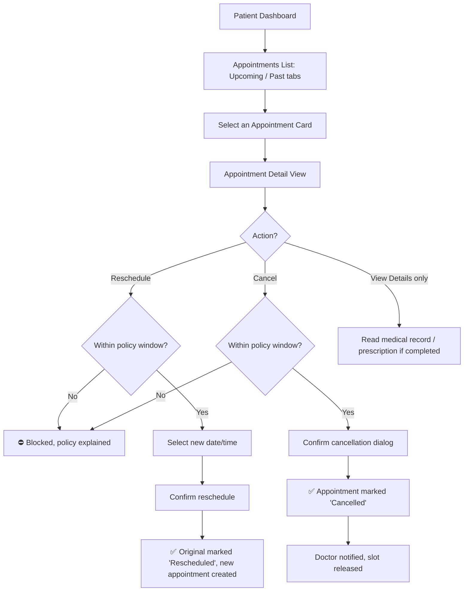

**Steps:**
1. Patient navigates to **Appointments** from the dashboard or sidebar, landing on a list with **Upcoming** and **Past** tabs.
2. Patient selects an appointment card to open its **Detail View**.
3. From the detail view, available actions depend on status and policy:
   - **Reschedule** or **Cancel** — only available for `pending`/`confirmed` appointments **within** the configured cancellation/reschedule cutoff window.
   - **View medical record / prescription** — available once the appointment is `completed` and related records exist.
4. **Reschedule path:** Patient selects a new date/time (same underlying flow as P1 steps 4–6) → confirms → original appointment is marked `rescheduled`, a new linked appointment is created, and both Patient and Doctor are notified.
5. **Cancel path:** Patient confirms via a destructive-confirmation modal (per DESIGN_GUIDELINES.md) stating the consequence plainly → appointment marked `cancelled`, slot released back into availability, Doctor notified.
6. **Outside policy window:** Both actions are disabled (not hidden) with an explanatory message and a suggested next step (e.g., "Contact the hospital directly to modify this appointment").

**Edge Cases:**
- Patient attempts to reschedule into a slot that becomes unavailable mid-selection → same race-condition handling as P1.
- Patient attempts to cancel an appointment already marked `completed` or `cancelled` by the Doctor/Admin in the interim (stale UI state) → action button reflects the true current status on next load; a stale action attempt returns a clear "This appointment's status has changed" message with a refreshed view.

---

### P3 — View Medical Records & Prescriptions

**Goal:** A Patient reviews their clinical history.

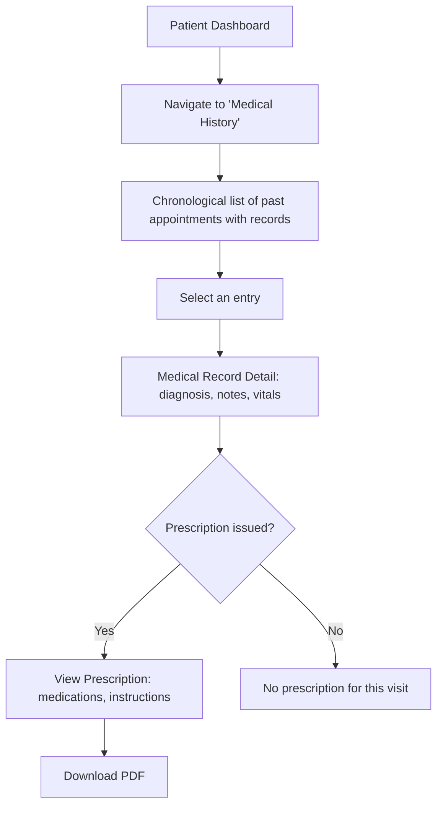

**Steps:**
1. Patient navigates to **Medical History** from the dashboard/sidebar.
2. A chronological, read-only list of past appointments with associated records is displayed.
3. Selecting an entry opens the **Medical Record Detail** (diagnosis, symptoms, vitals, doctor notes).
4. If a prescription was issued for that visit, it's shown inline or via a linked view, with a **Download PDF** action.
5. Superseded prescriptions (corrected versions) are visually marked and linked to their replacement, preserving a transparent history rather than hiding the correction.

**Edge Cases:**
- Appointment has no medical record yet (e.g., recently completed, doctor hasn't documented it) → clear "Record pending" state, not a blank/broken page.
- Patient has zero history → standard Empty State guiding them to book their first appointment.

---

### P4 — Profile & Settings Management

**Goal:** A Patient keeps their account information current.

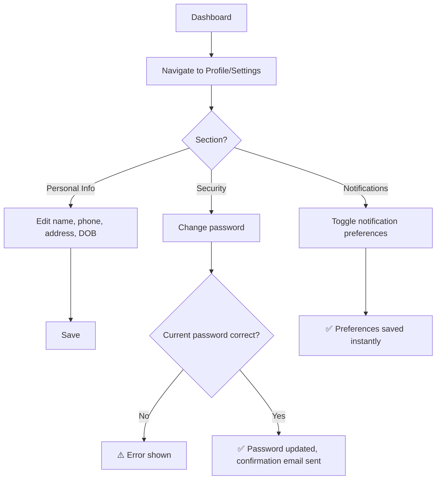

**Steps:**
1. Patient opens **Settings** via the account menu or sidebar.
2. Vertical tab navigation separates **Personal Info**, **Security**, and **Notification Preferences** (per DESIGN_GUIDELINES.md settings pattern).
3. Personal Info edits are saved via an explicit **Save** action with inline validation.
4. Password change requires current password confirmation; on success, a confirmation email is sent as a security notice.
5. Notification preference toggles (Switch components) save instantly on change — no separate Save step, consistent with their "immediate effect" nature.
6. Changing the email address triggers re-verification (see Cross-Cutting Flow C2); the new email is inactive for login until verified.

---

### P5 — Submit a Review

**Goal:** A Patient rates a completed appointment.

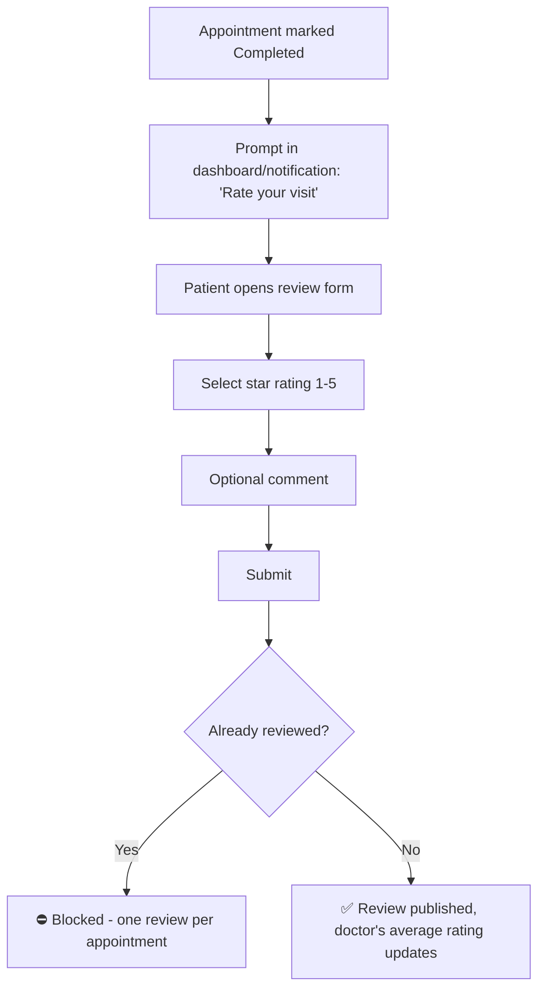

**Steps:**
1. Once an appointment is marked `completed`, the Patient sees a prompt (dashboard widget and/or notification) inviting a review.
2. Patient opens the review form, selects a 1–5 star rating, optionally adds a comment.
3. On submit, the system verifies no review already exists for this appointment (one review per appointment, enforced server-side).
4. Review is published (subject to Admin visibility moderation) and the doctor's aggregate rating recalculates.

---

## Doctor Flows

### D1 — Daily Schedule Review & Consultation Workflow

**Goal:** A Doctor works through their day's appointments.

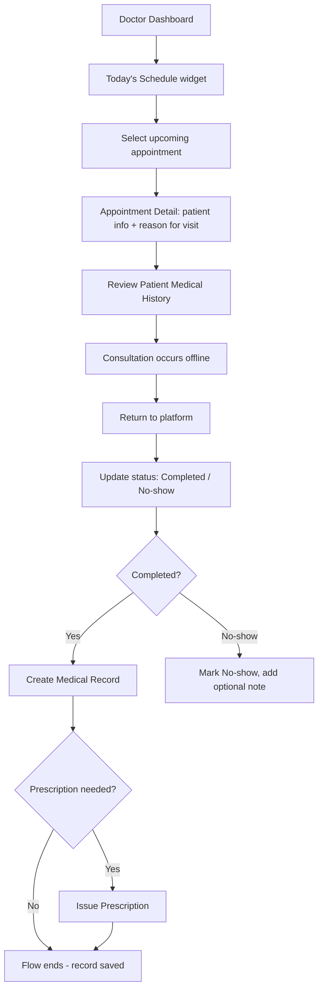

**Steps:**
1. Doctor logs in, lands on the **Doctor Dashboard**, sees **Today's Schedule** as the primary widget with the current/next appointment emphasized.
2. Doctor selects an appointment to view patient details and stated reason for visit.
3. Doctor reviews the **patient's medical history** (scoped only to patients they have a consultation relationship with) ahead of or during the consultation.
4. Consultation occurs offline (in-person/telemedicine, outside the system).
5. Doctor returns to the platform and updates the appointment status:
   - **Completed** → proceeds to document the visit.
   - **No-show** → marked with an optional note; no medical record is created for a no-show.
6. If completed, Doctor creates a **Medical Record** (diagnosis required, other fields optional).
7. **Decision:** If medication is needed, Doctor proceeds to **Issue Prescription** (see D2); otherwise the flow ends with the record saved.

**Edge Cases:**
- Doctor attempts to mark an appointment `completed` without ever having opened/started it → still permitted (some workflows are retroactive), but the system timestamps `completed_at` at the moment of the status change, not assumed to match the original slot time.
- Appointment auto-flags as a potential no-show if left unaddressed past a grace period after the scheduled end time — surfaced to both the Doctor (action needed) and Admin (visibility) rather than sitting silently unresolved.

---

### D2 — Issue a Prescription

**Goal:** A Doctor documents a treatment plan.

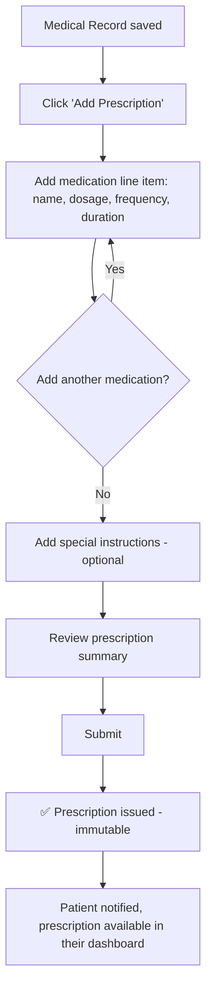

**Steps:**
1. From a saved Medical Record, Doctor clicks **"Add Prescription."**
2. Doctor adds one or more medication line items (name, dosage, frequency, duration), each individually removable before submission.
3. Doctor optionally adds special instructions (e.g., "take with food").
4. Doctor reviews the full prescription summary before submitting — since prescriptions are immutable once issued, this review step is deliberately emphasized.
5. On submit, the prescription is created and locked; the Patient is notified and can view/download it immediately.

**Edge Cases:**
- Doctor needs to correct an already-issued prescription → uses the **Supersede** action (a new prescription is created referencing the original), never an in-place edit — this is communicated clearly in the UI ("Issue a corrected prescription" rather than "Edit").

---

### D3 — Schedule & Availability Management

**Goal:** A Doctor sets or updates their working availability.

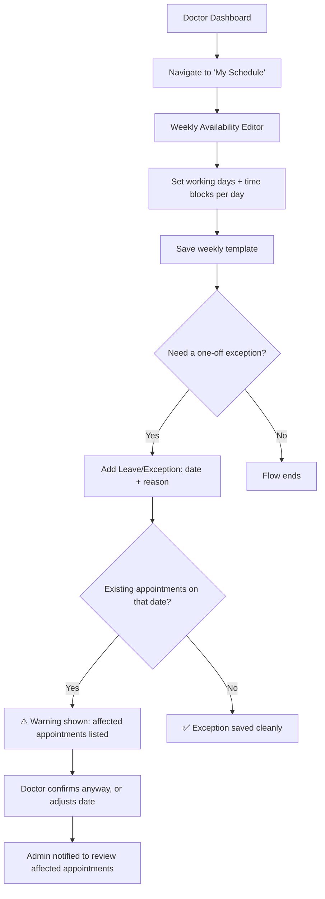

**Steps:**
1. Doctor navigates to **My Schedule**, presented as a visual weekly grid (days × time blocks).
2. Doctor defines or edits recurring working hours per day (click-and-drag or explicit time entry) and saves the template — this becomes the base pattern all future slot availability is computed from.
3. **Decision:** If the Doctor needs a one-off exception (leave, conference, extended hours), they add a dated exception separately from the recurring template.
4. If the exception date already has confirmed patient appointments, the system surfaces a clear warning listing the affected appointments **before** the exception is finalized.
5. Doctor may proceed anyway (the exception is saved, and the Admin is automatically notified to reassign/resolve affected appointments) or choose a different date to avoid the conflict entirely.

---

### D4 — Review Personal Performance

**Goal:** A Doctor checks their own metrics.

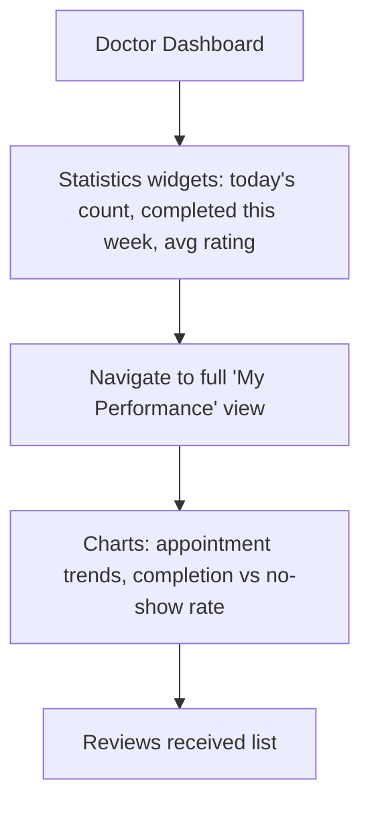

**Steps:**
1. Summary statistics appear directly on the Doctor Dashboard as at-a-glance widgets.
2. Doctor can navigate to a dedicated **My Performance** view for deeper trend charts (appointment volume over time, completion/no-show ratio) and a list of received patient reviews — scoped strictly to their own data, with no visibility into other doctors' metrics.

---

## Administrator Flows

### A1 — Doctor Onboarding

**Goal:** An Admin adds a new doctor to the platform.

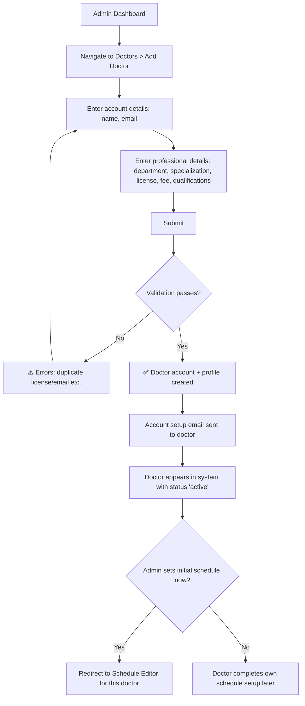

**Steps:**
1. Admin navigates to **Doctors → Add Doctor**.
2. Admin enters account-level details (name, email) and professional details (department, specialization, license number, consultation fee, qualifications).
3. On submission, server-side validation checks for duplicate email/license number.
4. On success, the doctor's `users` + `doctors` records are created, and an account-setup email (including a password-creation link) is sent to the new doctor.
5. **Decision:** Admin may immediately configure the doctor's initial availability schedule, or leave that for the doctor to complete themselves after their first login.

**Edge Cases:**
- Duplicate license number or email → inline validation error, no partial record created (wrapped in a database transaction).
- Admin assigns a department that is currently `inactive` → blocked with a message to reactivate the department first or choose another.

---

### A2 — Appointment Oversight & Conflict Resolution

**Goal:** An Admin monitors and intervenes on hospital-wide appointments.

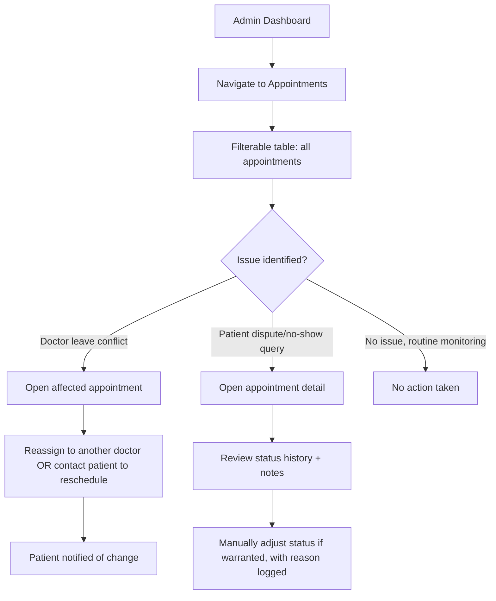

**Steps:**
1. Admin navigates to the **Appointments** management view — a comprehensive, filterable table (by status, doctor, department, date range).
2. Admin identifies an issue requiring intervention, most commonly triggered by a system-generated flag (e.g., a doctor's leave exception affecting existing bookings, from flow D3).
3. Admin opens the affected appointment and chooses to **reassign** it to another available doctor in the same department, or contacts the patient to arrange a reschedule.
4. The patient is notified of any admin-driven change to their appointment.
5. For disputes or status-correction needs (e.g., a no-show marked in error), Admin can manually adjust status with a required reason, which is written to the audit log.

---

### A3 — Department & System Configuration

**Goal:** An Admin manages departments and hospital-wide settings.

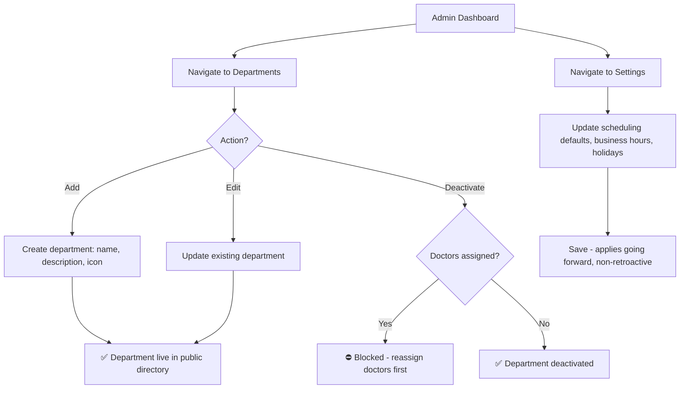

**Steps:**
1. Admin manages departments via standard CRUD screens.
2. Attempting to deactivate a department with currently assigned active doctors is blocked with a clear instruction to reassign those doctors first — preventing an orphaned-doctor data state.
3. Separately, Admin accesses **Settings** to configure hospital-wide defaults (slot duration, cancellation cutoff, business hours, holiday calendar, notification templates).
4. Settings changes are explicitly scoped as **non-retroactive** — the UI communicates that existing booked appointments are unaffected by a policy change.

---

### A4 — Reporting & Analytics Review

**Goal:** An Admin reviews operational performance and exports data.

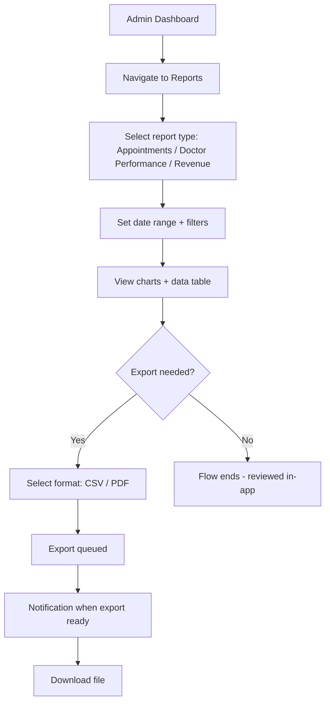

**Steps:**
1. Admin navigates to **Reports**, selects a report type (Appointment Volume, Doctor Performance, Revenue once Phase 3 is live).
2. Admin sets a date range (capped at a sane maximum) and optional filters (department, doctor).
3. Report renders as charts plus an underlying data table.
4. **Decision:** For a full export, the request is queued (not processed synchronously) with a notification delivered when the file is ready for download — protecting the UI from long-running export operations.

---

### A5 — User & Role Management

**Goal:** An Admin manages accounts and access control.

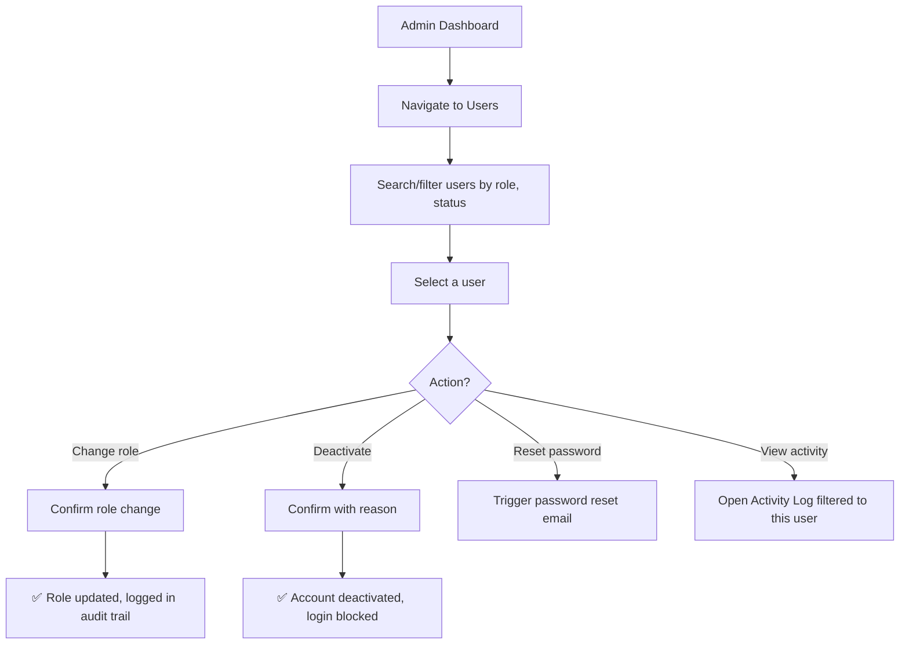

**Steps:**
1. Admin navigates to **Users**, searches/filters across all roles.
2. Selecting a user exposes available management actions: change role, deactivate/reactivate, force a password reset, or view their filtered activity log.
3. All sensitive actions (role changes, deactivations) require a confirmation step and are recorded in `activity_logs` for accountability.

---

## Cross-Cutting Flows

### C1 — Authentication Gate (Protected Action While Unauthenticated)

Applies whenever a Guest attempts an action requiring authentication (booking, viewing a dashboard, etc.).

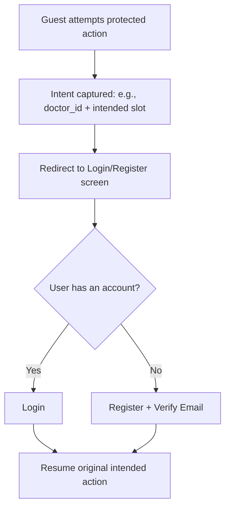

**Key Rule:** The user's original intent (e.g., "book Dr. Islam on Aug 12 at 9:00") is preserved across the authentication detour and automatically resumed afterward — the user never has to re-navigate from scratch.

---

### C2 — Email Change & Re-verification

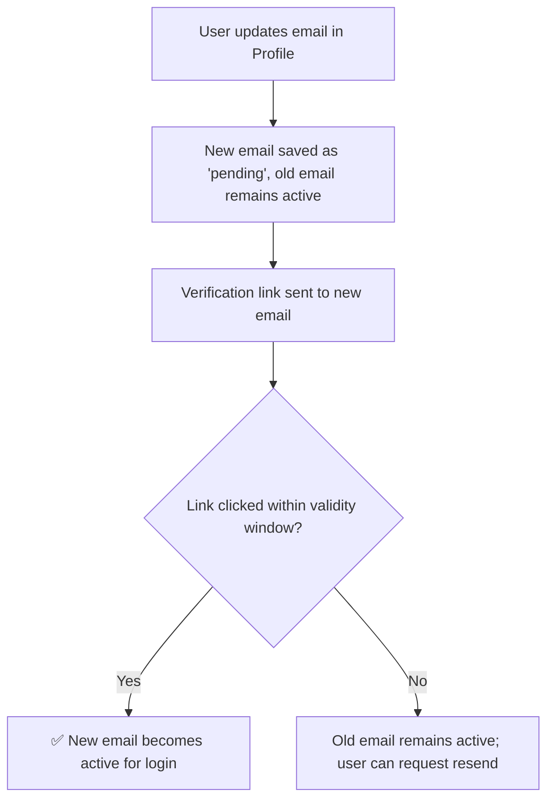

---

### C3 — Notification Delivery (Reminder Example)

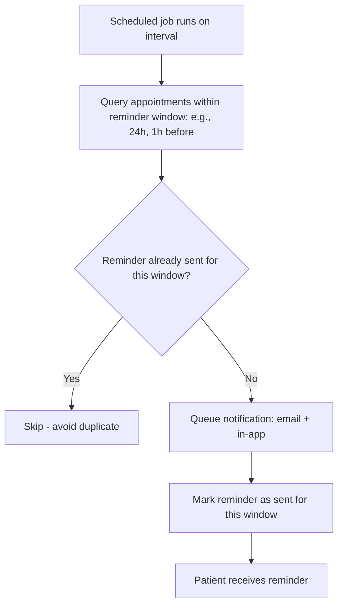

**Key Rule:** Reminders are idempotent per window — a job re-run or retry never results in a duplicate reminder reaching the patient.

---

### C4 — Session Expiry Mid-Task

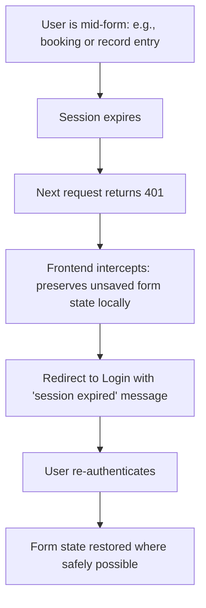

**Key Rule:** Session expiry never silently discards in-progress clinical documentation (medical records, prescriptions) without warning — the user is informed and, where feasible, their draft is preserved for re-submission after re-authenticating.

---

## Edge Case & Exception Flows

### E1 — Double-Booking Race Condition

Two patients attempt to book the same doctor/date/time simultaneously.

1. Both clients pass client-side availability checks (both saw the slot as open moments earlier).
2. Both submit `POST /appointments` near-simultaneously.
3. The database-level composite unique constraint `(doctor_id, appointment_date, start_time)` (see DATABASE_DESIGN.md) allows only the first write to succeed.
4. The second request receives `409 Conflict`.
5. The losing patient's UI displays: *"This slot was just booked by another patient. Here are the next available times:"* — followed by a refreshed slot list, keeping the user in-flow rather than dead-ending them.

### E2 — Doctor Goes on Leave With Existing Bookings

1. Doctor (or Admin, on their behalf) adds an `unavailable` schedule exception for a date with confirmed appointments.
2. System detects the conflict at save time (see D3) and surfaces affected appointments before finalizing.
3. If confirmed anyway, the exception is saved and the Admin receives a prioritized action item.
4. Admin resolves each affected appointment individually: reassign to another doctor in the same department, or coordinate a reschedule with the patient — the system never auto-cancels a patient's appointment without an explicit resolution decision by a human.

### E3 — Patient Attempts Cancellation Outside Policy Window

1. Patient opens an appointment within the cancellation-restricted window (e.g., less than 2 hours before the scheduled time).
2. The Cancel/Reschedule buttons render in a disabled state with a tooltip/inline note explaining the policy and cutoff time.
3. Patient is guided to a "Contact the hospital" path (phone/contact page) for exceptional circumstances outside the self-service policy.

### E4 — Payment Failure Mid-Booking (Phase 3)

1. Patient completes the booking form and proceeds to payment.
2. Stripe payment fails (card declined, network issue).
3. The appointment record remains in a `pending`/unconfirmed state — **not** silently created as `confirmed` without payment where payment is required by policy.
4. Patient is shown a clear retry option; if payment is never completed within a defined grace period, the held slot is released back to general availability and the patient is notified.

### E5 — Duplicate Patient Profile Suspicion

1. Admin, while managing patients, encounters two profiles with matching name + date of birth + phone number.
2. Admin flags for review (manual process in v1 — no automated merge in Phase 1/2) and can deactivate the duplicate while preserving both records' historical data intact for audit integrity (never a destructive merge/delete in the initial release).

---

## Appointment Status State Machine

The appointment lifecycle referenced throughout the flows above follows a strict, enforced state machine — no UI or API action can move an appointment into an invalid transition.

```mermaid
stateDiagram-v2
    [*] --> pending: Patient books
    pending --> confirmed: Auto/Admin confirmation
    confirmed --> completed: Doctor marks completed
    confirmed --> cancelled: Patient/Doctor/Admin cancels
    confirmed --> no_show: Grace period elapses unattended
    confirmed --> rescheduled: Patient/Admin reschedules
    pending --> cancelled: Cancelled before confirmation
    rescheduled --> [*]: Superseded by new appointment
    completed --> [*]
    cancelled --> [*]
    no_show --> [*]
```

**Rules enforced at every layer (UI, API, database):**
- No transition may skip a required intermediate state (e.g., `pending` cannot jump directly to `completed`).
- `completed`, `cancelled`, and `no_show` are terminal states for that specific appointment row — a `rescheduled` appointment spawns a **new** row rather than reopening the original.
- Any transition into `cancelled` requires a reason; any transition into `no_show` may include an optional doctor note.

---

## Screen Inventory by Flow

| Flow | Primary Screens Involved |
|---|---|
| G1 — Browse & Discover | Homepage, Departments Listing, Doctors Directory, Doctor Profile |
| G2 — Registration | Registration Form, Check Your Email, Email Verified Landing |
| P1 — Booking | Doctor Search, Doctor Profile (Booking Panel), Booking Summary, Confirmation Screen |
| P2 — Manage Appointments | Appointments List (Upcoming/Past), Appointment Detail, Reschedule Modal, Cancel Confirmation Modal |
| P3 — Medical History | Medical History List, Medical Record Detail, Prescription Detail |
| P4 — Profile & Settings | Settings (Personal Info / Security / Notifications tabs) |
| P5 — Review Submission | Review Form (modal or inline) |
| D1 — Daily Workflow | Doctor Dashboard, Today's Schedule, Appointment Detail, Status Update |
| D2 — Prescription | Medical Record Form, Prescription Form, Prescription Summary |
| D3 — Schedule Management | Weekly Availability Editor, Exceptions List, Conflict Warning Modal |
| D4 — Performance | Doctor Dashboard Widgets, My Performance View |
| A1 — Doctor Onboarding | Add Doctor Form, Doctor Detail, Schedule Editor (redirect) |
| A2 — Appointment Oversight | Admin Appointments Table, Appointment Detail, Reassign Modal |
| A3 — System Configuration | Departments CRUD Screens, Settings (Admin) |
| A4 — Reporting | Reports Dashboard, Report Detail View, Export Status |
| A5 — User Management | Users Table, User Detail, Role Change Modal, Activity Log |

---

## Flow Completion Checklist

Before a flow is considered implementation-ready, it must satisfy:

- [ ] Every decision branch has a defined, designed outcome (no dead ends).
- [ ] Every error state has user-facing copy, not a raw system error.
- [ ] Every destructive or irreversible action has an explicit confirmation step.
- [ ] Every flow respects the role-based authorization boundaries defined in REQUIREMENT_ANALYSIS.md and API_SPECIFICATION.md.
- [ ] Every asynchronous action (notifications, exports, reminders) has a visible status the user can check.
- [ ] Every flow has been validated against the Appointment Status State Machine where appointments are involved.
- [ ] Every flow's screens are accounted for in the Screen Inventory and covered by DESIGN_GUIDELINES.md component patterns.

---

**End of Document**
